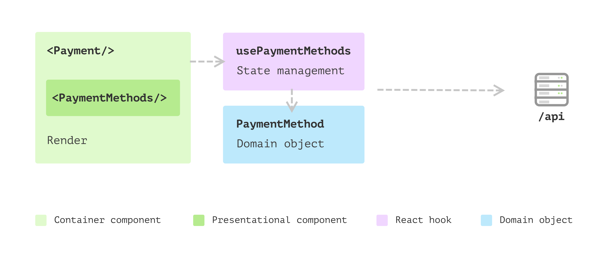

# Step 3 — Data modelling to encapsulate logic

## Structure

```
src/routes/step3/
├── index.tsx                          — route
├── README.md                          — describes the refactoring
├── types/remote-payment-method.ts     — RemotePaymentMethod only (LocalPaymentMethod removed)
├── adapters/fetchAdapter.ts           — same mock
├── models/PaymentMethod.ts            — domain class encapsulating data + behaviour
├── hooks/usePaymentMethods.ts         — uses PaymentMethod class + convertPaymentMethods
└── components/
    ├── Payment.tsx                    — unchanged composition
    └── PaymentMethods.tsx             — uses method.isDefaultMethod instead of string check
```

## What changed

### 1. `PaymentMethod` domain class

Introduced a class that centralizes all logic around a single payment method:

```ts
class PaymentMethod {
  get provider()       { return this.remotePaymentMethod.name }
  get label()          { return this.provider === 'cash' ? `Pay in cash` : `Pay with ${this.provider}` }
  get isDefaultMethod(){ return this.provider === 'cash' }
}
```

- Data and behaviour live together in one place
- No UI-related information — a pure domain object

### 2. `convertPaymentMethods` function

Extracted the data transformation into a standalone function:

```ts
const convertPaymentMethods = (methods: RemotePaymentMethod[]) => {
  if (methods.length === 0) return []
  const extended = methods.map((method) => new PaymentMethod(method))
  extended.push(payInCash)
  return extended
}
```

### 3. `LocalPaymentMethod` type removed

The plain object type is replaced by the `PaymentMethod` class instance. The hook now returns `PaymentMethod[]` instead of `LocalPaymentMethod[]`.

### 4. `PaymentMethods` component updated

Replaced the magic string check with the domain object getter:

```diff
- defaultChecked={method.provider === 'cash'}
+ defaultChecked={method.isDefaultMethod}
```

## Problem solved

**Logic leak in views** — in Step 2, the `PaymentMethods` component contained a business rule: `method.provider === 'cash'`. This is a logic leak — the view knows about a specific provider name. If the default payment method changes, you'd have to find and update every component that checks for `"cash"`.

After this refactoring:

- **All business logic** lives in `PaymentMethod` — label formatting, default selection
- **Views are pure** — they call getters, they don't contain conditionals about domain concepts
- **`PaymentMethod` is reusable** — it's a standalone class with no React dependency, usable in tests, backend code, or other views
- **`convertPaymentMethods` is cohesive** — one function, one file, one responsibility

## Reference

This corresponds to the section
["Data modelling to encapsulate logic"](https://martinfowler.com/articles/modularizing-react-apps.html#DataModellingToEncapsulateLogic)
in Martin Fowler's article.


